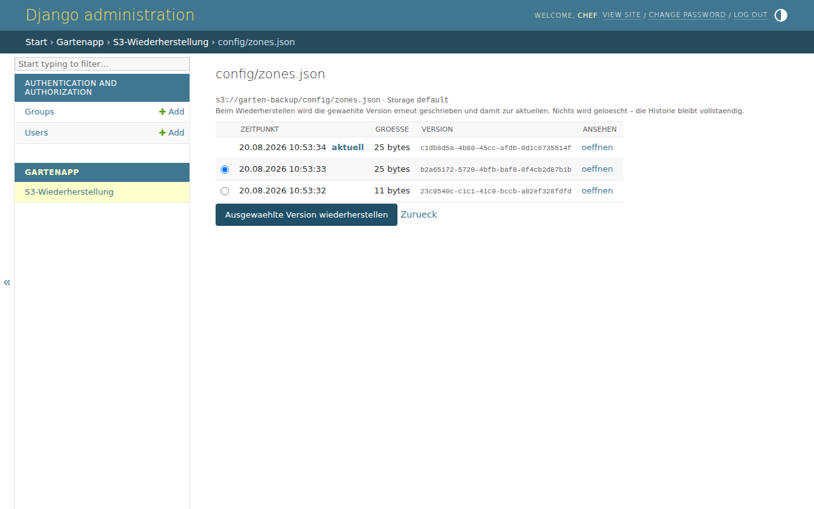
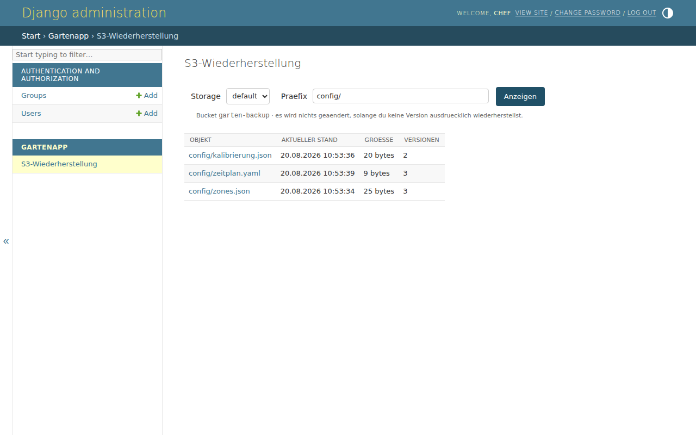
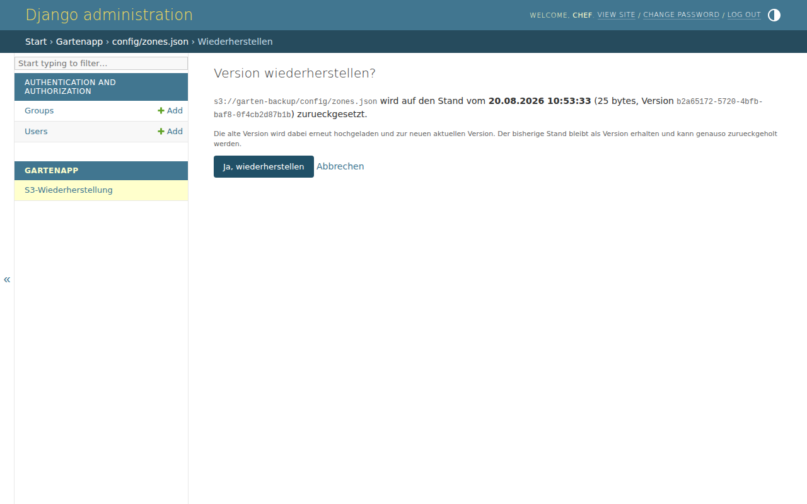
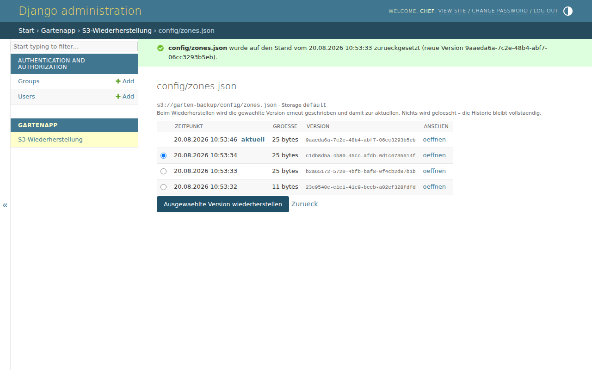

# django-s3-restore

Frühere Versionen aus einem versionierten S3-Bucket wiederherstellen – über den
Django-Admin, einen Management-Command oder ein Standalone-Script.

Wiederherstellen heißt hier **Rollback im Bucket**: die gewählte alte Version wird
per `copy_object` erneut geschrieben und damit zur neuen aktuellen Version.
Es wird nie etwas endgültig gelöscht, die Historie bleibt vollständig erhalten –
auch der Stand von vor dem Rollback lässt sich genauso wieder zurückholen.



## Voraussetzungen

* Python 3.9+, Django 4.2+, `django-storages` mit `boto3`
* ein S3-Bucket mit **aktiviertem Object-Versioning**
* IAM-Rechte: `s3:ListBucketVersions`, `s3:GetObjectVersion`, `s3:PutObject`
  (für `--restore-deletes` zusätzlich `s3:DeleteObject`)

## Installation

```bash
pip install django-storages boto3
# das Repo als App ins Projekt kopieren oder installieren:
pip install -e .
```

```python
# settings.py
INSTALLED_APPS = [
    "django.contrib.admin",
    ...
    "s3restore",
]

STORAGES = {
    "default": {
        "BACKEND": "s3restore.storage.VersionedS3Storage",
        "OPTIONS": {
            "bucket_name": "garten-backup",
            "region_name": "eu-central-1",
            "location": "media",       # Präfix im Bucket
            "file_overwrite": False,
        },
    },
    "staticfiles": {"BACKEND": "django.contrib.staticfiles.storage.StaticFilesStorage"},
}
```

`VersionedS3Storage` ist eine Subklasse von `S3Boto3Storage` und funktioniert
überall dort, wo bisher `S3Boto3Storage` stand. Es wird **keine eigene
boto3-Session** aufgebaut: Client, Bucket, Credentials und der `location`-Präfix
kommen aus der Storage-Konfiguration. Namen werden deshalb überall
Django-relativ angegeben (`config/zones.json`), nicht als voller S3-Key –
genau so, wie sie in einem `FileField` stehen.

Danach einmal `python manage.py migrate` laufen lassen: das legt die beiden
Berechtigungen an (eine Tabelle entsteht nicht, das Admin-Modell ist
`managed = False`).

## Admin

Die Seite hängt unter **Admin → S3 Restore → S3-Wiederherstellung**.
Ablauf: Präfix durchsuchen → Objekt anklicken → Version wählen → bestätigen.

| Übersicht | Bestätigung |
|---|---|
|  |  |

Jede alte Version hat einen *öffnen*-Link (presigned URL, 5 Minuten gültig) –
so lässt sich der Inhalt prüfen, **bevor** zurückgerollt wird. Nach dem Rollback:



Jede Wiederherstellung wird als `LogEntry` in der Admin-Historie festgehalten
(wer, wann, welche Version).

### Rechte

| Permission | Bedeutung |
|---|---|
| `s3restore.view_s3version` | Historie ansehen |
| `s3restore.restore_s3version` | zusätzlich wiederherstellen |

Wer nur das Ansichtsrecht hat, bekommt keine Auswahlfelder zu sehen; ein trotzdem
abgesetzter POST wird serverseitig mit 403 abgewiesen. Der Rollback läuft
ausschließlich per POST mit CSRF-Token und Bestätigungsseite – ein GET ändert nie
etwas. Der Storage-Alias aus der URL wird gegen `settings.STORAGES` geprüft, damit
über den Query-String kein fremder Bucket angesteuert werden kann.

## Management-Command

```bash
python manage.py restore_s3 config/zones.json --list          # Historie ansehen
python manage.py restore_s3 config/zones.json                 # eine Version zurück
python manage.py restore_s3 config/zones.json --steps 3 --noinput
python manage.py restore_s3 config/zones.json --version-id 3sL9v.Kx0dQe7pM1
python manage.py restore_s3 config/ --prefix --at 2026-08-18T18:00 --dry-run
python manage.py restore_s3 backups/db.sqlite3 --storage backups
```

| Option | Wirkung |
|---|---|
| `--steps N` | N Versionen zurück (Standard: 1) |
| `--version-id ID` | exakte Version (nur für ein einzelnes Objekt) |
| `--at ZEIT` | Stand zu einem Zeitpunkt, ISO-Format, lokale Zeitzone |
| `--prefix` | Name als Verzeichnis-Präfix behandeln |
| `--list` | nur anzeigen, nichts ändern |
| `--dry-run` | Plan ausgeben, nichts ändern |
| `--restore-deletes` | mit `--at`: war das Objekt damals gelöscht, wird ein neuer Delete-Marker gesetzt |
| `--noinput` | ohne Rückfrage |
| `--storage ALIAS` | Alias aus `settings.STORAGES` (Standard: `default`) |

## Aus Python heraus

```python
from django.core.files.storage import storages

storage = storages["default"]

for v in storage.versions("config/zones.json"):
    print(v.last_modified, v.size, v.version_id, v.is_latest)

result = storage.restore("config/zones.json", steps=1)
print(result.action, result.new_version_id)   # restored / skipped / failed

storage.restore_all("config/", at=zeitpunkt, dry_run=True)
```

## Standalone-Script (ohne Django)

`standalone/s3_restore.py` macht dasselbe mit reinem boto3 – nützlich auf einem
Gerät, auf dem kein Django läuft:

```bash
./standalone/s3_restore.py --bucket garten-backup --key config/zones.json --list
./standalone/s3_restore.py --bucket garten-backup --prefix config/ \
    --at 2026-08-18T18:00:00 --dry-run
```

## Tests

```bash
pip install -e ".[dev]"
pytest
```

60 Tests gegen einen mit [moto](https://github.com/getmoto/moto) gemockten
S3-Bucket – kein echtes AWS, keine Credentials nötig. Die Screenshots oben
stammen aus einem Playwright-Durchlauf gegen genau diesen gemockten Bucket.

## Details, die in der Praxis beißen

* **Delete-Marker.** Ist der aktuelle Stand ein Delete-Marker, holt `--steps 1`
  die jüngste echte Version zurück (und nicht eine zu weit).
* **Sekundengenauigkeit.** S3-Zeitstempel lösen nur auf Sekunden auf. Bei
  Gleichstand gewinnt die als aktuell markierte Version, danach der
  Delete-Marker (der kann nur nach einem Schreibvorgang entstanden sein).
* **Exakter Name statt Präfix.** Ein einzelner Name matcht exakt – `zones.json`
  rollt nicht versehentlich `zones.json.bak` mit zurück.
* **Metadaten.** `MetadataDirective=COPY` erhält Content-Type, Metadaten und Tags
  der alten Version.
* **Glacier.** Liegt die Zielversion in Glacier/Deep Archive, kommt eine
  verständliche Meldung statt eines Stacktraces – sie muss erst per
  `restore_object` verfügbar gemacht werden.
* **Suspended Versioning.** Wird erkannt und gemeldet: alte Versionen sind noch
  da, neue entstehen aber nicht mehr.
